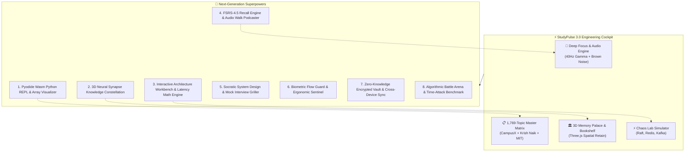
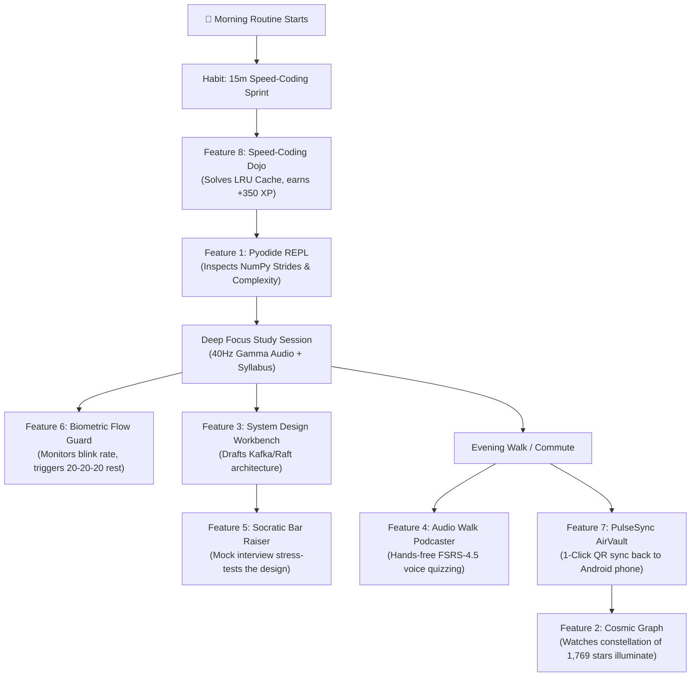

# ⚡ StudyPulse FOCUS ENGINE: Next-Gen Feature Roadmap & Architectural Strategy
### *Transforming StudyPulse into a World-Class Offline Engineering Cockpit for Piyush Tiwari*

---

> **Prepared For**: Piyush Tiwari — Data Science, Machine Learning, Distributed Systems & AI Engineering  
> **Repository**: [`/root/MY_STUDY_PROJECT`](file:///root/MY_STUDY_PROJECT)  
> **Platform**: 100% Offline Client-Side Web Application & Standalone Android APK (`com.studypulse.focusengine`)  
> **Curriculum Baseline**: 7 Flagship Programs · 113 Modules · 1,014+ Lectures · 1,769 Topics · 634.6 Hours  
> **Architectural Philosophy**: Zero-Cloud Dependency, Local-First (`localStorage` / `IndexedDB`), Hardware-Accelerated (WebGL / Three.js, Web Audio, WebAssembly, Canvas 2D), Warm Editorial Cybernetic Aesthetics.

---

## 🧭 Executive Summary & Strategic Vision

StudyPulse is already a tour de force of personal engineering workstations: pairing a 1,769-topic multi-curriculum database with hardware-accelerated Three.js 3D environments, an interactive distributed systems chaos laboratory, an in-browser 4-channel Web Audio synthesizer, and a gamified RPG focus engine.

To take StudyPulse from an exceptional tracker to a **world-class cognitive cockpit**, the next evolution must empower Piyush to **code, simulate, recall, stress-test, and synthesize knowledge without ever leaving the application**. Every feature proposed below obeys three non-negotiable architectural axioms:
1. **100% Offline & Local-First**: Zero external servers, zero telemetry, zero mandatory cloud subscriptions. All state remains encrypted or persisted in browser storage (`localStorage` and `IndexedDB`).
2. **Zero-Lag Native Performance**: Leveraging WebAssembly (Wasm), Web Workers, and GPU shaders to maintain 60 FPS rendering on both desktop browsers and Android smartphones.
3. **Hyper-Specialized for High-Yield Engineering**: Every capability directly accelerates mastery of Data Science, Deep Learning, Foundation Models, and Distributed Systems (MIT 6.824, Stanford CS229, CampusX DSMP, Krish Naik Masterclasses).

---



---

## 💎 The 8 Groundbreaking Feature Proposals

---

### Feature 1: Pyodide WebAssembly Kernel & Interactive Array Visualizer ("StudyPulse REPL")
> *"Zero-Latency, In-Browser Python 3.11 & NumPy Execution Engine with Step-by-Step Memory Inspection"*

```
+-----------------------------------------------------------------------------------+
|  [>] PYTHON REPL: Session 14 - Advanced NumPy Vectorization                        |
+-----------------------------------------------------------------------------------+
|  1  import numpy as np                                                            |
|  2  # Broadcasting: (3, 1) + (1, 4) -> (3, 4)                                     |
|  3  A = np.arange(3).reshape(3, 1)                                                |
|  4  B = np.array([10, 20, 30, 40]).reshape(1, 4)                                  |
|  5  C = A + B                                                                     |
|  6  print("Output Shape:", C.shape)                                               |
+-----------------------------------------------------------------------------------+
|  [ RUN (Ctrl+Enter) ]  [ ⏱️ Benchmark (%timeit) ]  [ 📊 Visualize Strides ]       |
+-----------------------------------------------------------------------------------+
|  >> STDOUT: Output Shape: (3, 4)                                                  |
|  >> EXECUTION TIME: 0.18ms | HEAP: +128 Bytes | STRIDES: A=(8,8), B=(32,8)        |
+-----------------------------------------------------------------------------------+
```

#### 1. Core Value Proposition for Piyush
When studying complex algorithms, vectorization rules, backpropagation math, or sliding window problems, context switching to an external terminal or Jupyter notebook breaks flow state. The **StudyPulse REPL** allows Piyush to immediately test concepts within any curriculum topic card, run `%timeit` benchmarks on algorithmic implementations, and inspect memory strides of NumPy arrays directly inside the app.

#### 2. User Experience & UI Walkthrough
* **Topic Integration**: Every topic card in the syllabus (e.g., *Week 5: Advanced NumPy*, *Week 2: Python Lists*, or *DSA: Sliding Window*) features an embedded **`[💻 Code Sandbox]`** toggle.
* **Cybernetic Monospace Editor**: Features syntax highlighting via a lightweight Prism.js engine, line numbering, auto-closing brackets, and multi-cursor support styled in warm amber and mocha tones.
* **Live Visualizer Panel**:
  * **Array Inspector**: Renders 1D/2D/3D matrices as color-coded interactive grid heatmaps showing broadcasting dimensions and strides.
  * **Pointer & Reference Visualizer**: For Python core topics, renders object IDs, reference counts, and memory layout (demonstrating how `list` stores pointers vs contiguous `numpy.ndarray`).
* **Run Velocity**: Instantaneous execution via `Ctrl + Enter` with execution timing in microseconds.

#### 3. Technical Architecture & Feasibility
* **Execution Engine**: [Pyodide](https://pyodide.org/) (Python compiled to WebAssembly) or a lightweight offline Wasm MicroPython runtime (~350KB).
* **Zero Main-Thread Blocking**: All execution runs in a dedicated `Web Worker` (`worker-python.js`). Long-running loops never freeze the UI or the 3D canvas.
* **Storage & Caching**: The Wasm runtime and wheels (`numpy`, `pandas`) are stored locally in the browser's `CacheStorage` API via Service Worker during the first APK initialization or web visit.
* **Offline Guarantee**: 100% client-side. Zero server communication.

#### 4. Actionable Implementation Roadmap
1. **Milestone 1**: Integrate a Web Worker hosting Pyodide with `postMessage` protocol for script execution, standard output capture, and error boundary handling.
2. **Milestone 2**: Build the collapsible editor drawer in `index.html` with Monaco-lite or CodeMirror 6 (vanilla bundle) styled with StudyPulse's CSS variables.
3. **Milestone 3**: Add 25 pre-loaded high-yield engineering snippets (NumPy broadcasting, Raft election timer simulation, sliding window maximum, backprop matrix derivation).

---

### Feature 2: 3D Neural Synapse Knowledge Constellation ("The Cosmic Graph")
> *"Interactive WebGL Celestial Knowledge Graph Connecting 1,769 Topics Across Math, Code, and Distributed Systems"*

```mermaid
graph LR
    LA["📐 Linear Algebra<br/>(Eigenvalues & SVD)"] --> PCA["📊 PCA & Dimension<br/>Reduction"]
    PCA --> LAT["🌌 Latent Space<br/>Representations"]
    LAT --> EMB["🔤 Word & Token<br/>Embeddings"]
    EMB --> VDB["🗄️ Vector Databases<br/>(HNSW & Milvus)"]
    VDB --> RAFT["⚡ Distributed Consensus<br/>(MIT 6.824 / Raft)"]
    
    style LA fill:#292524,stroke:#f59e0b,stroke-width:2px,color:#faf7f2
    style PCA fill:#292524,stroke:#10b981,stroke-width:2px,color:#faf7f2
    style LAT fill:#292524,stroke:#00f0ff,stroke-width:2px,color:#faf7f2
    style EMB fill:#292524,stroke:#a855f7,stroke-width:2px,color:#faf7f2
    style VDB fill:#292524,stroke:#ea580c,stroke-width:2px,color:#faf7f2
    style RAFT fill:#292524,stroke:#ef4444,stroke-width:2px,color:#faf7f2
```



#### 1. Core Value Proposition for Piyush
Engineering curricula often feel siloed. In reality, Mathematics, Machine Learning, and Cloud Systems are deeply entangled: *Linear Algebra* underpins *PCA*, which informs *Vector Embeddings*, which powers *Retrieval-Augmented Generation (RAG)*, which requires *Distributed Sharding and Raft Quorum*. The **Cosmic Graph** visually renders these cross-curriculum synapses in 3D space, illuminating the shortest learning trajectories to master complex topics.

#### 2. User Experience & UI Walkthrough
* **Entering the Cosmos**: Accessible via a new header tab or a dedicated button in the 3D Library. The screen smoothly transitions into a starfield with 1,769 floating luminous celestial bodies grouped into 7 planetary clusters (one for each flagship course).
* **Dynamic Node Illumination**:
  * ⚪ **Unexplored Topic**: Dim nebula node.
  * 🟡 **In Progress**: Pulsing amber solar flare.
  * 🟢 **Mastered Topic**: Radiant emerald star emitting gravitational light rays to connected downstream topics.
* **Semantic Synapse Highlighting**: Hovering over or tapping any node (e.g. *Scaled Dot-Product Attention*) draws glowing energy filaments to its prerequisites (*Matrix Multiplication*, *Softmax Derivative*) and downstream applications (*Transformer Decoder*, *LangChain RAG*).
* **Cinematic Fly-To Camera**: Double-tapping a node moves the Three.js camera into first-person orbit around the topic, displaying its module number, estimated study time, and personal notes.

#### 3. Technical Architecture & Feasibility
* **Rendering Engine**: Three.js `InstancedMesh` with custom GLSL vertex and fragment shaders for glowing star halos.
* **Physics & Layout**: Offline 3D Force-Directed Graph simulation computed using `d3-force-3d` in an asynchronous Web Worker to precalculate spatial coordinates $(x, y, z)$.
* **Memory Optimization**: 1,769 nodes rendered in a single draw call with instanced attribute buffers for position, color, and scale, consuming less than 18MB VRAM.
* **Data Binding**: Directly pulls node state from `state.completedTopics` in `studypulse.js`.

#### 4. Actionable Implementation Roadmap
1. **Milestone 1**: Generate the cross-curriculum dependency matrix (`curriculum-synapses.json`) linking related concepts across CampusX, Krish Naik, and MIT 6.824.
2. **Milestone 2**: Build `js/galaxy-3d.js` using `THREE.InstancedMesh` and Raycasting for fast mobile interaction.
3. **Milestone 3**: Add "Learning Path Navigator" overlay allowing Piyush to search "Path to LLM Engineer" and watch the graph highlight the optimal sequence of stars.

---

### Feature 3: Interactive System Design Workbench & Latency Math Engine ("Chaos Studio Architect")
> *"Zero-Dependency Excalidraw-Style Whiteboard with Real-Time Back-of-the-Envelope Capacity Estimator"*

```
+------------------------------------------------------------------------------------+
|  SYSTEM ARCHITECTURE WORKBENCH: "High-Throughput Feature Store & Inference Engine"  |
+------------------------------------------------------------------------------------+
|  [ COMPONENTS: 🔀 API Gateway | ⚡ Redis Cache | 📨 Kafka | 🧠 Triton Server ]     |
+------------------------------------------------------------------------------------+
|                                                                                    |
|   [Client 📱] ---> [Load Balancer] ===(100k RPS)===> [Triton Inference 🧠]         |
|                           |                                 |                      |
|                           v                                 v                      |
|                    [Redis L2 Cache] <=== (Feast) ===> [Feature Store 🗄️]           |
|                                                                                    |
+------------------------------------------------------------------------------------+
|  BACK-OF-THE-ENVELOPE MATH ENGINE (Live Calculator):                               |
|  * Target Throughput: [ 100,000 ] RPS          * Payload Size: [ 2.5 KB ]          |
|  * Daily Ingestion: 21.6 TB / day             * Bandwidth Required: 2.0 Gbps       |
|  * Redis RAM (20% Hot Working Set): 4.32 TB    * Min Replicas @ 5k RPS: 20 Nodes   |
|  * Estimated p99 Latency: 14.2 ms (L2 Hit: 92% @ 2ms, Cache Miss: 38ms)           |
+------------------------------------------------------------------------------------+
```

#### 1. Core Value Proposition for Piyush
System design interviews at top tech companies require two things: clean architectural diagrams and rapid, accurate back-of-the-envelope calculations (storage, bandwidth, IOPS, cache sizing, memory requirements). This feature merges an offline vector drafting board with an automated mathematical estimator, transforming theoretical understanding into battle-tested system design muscle memory.

#### 2. User Experience & UI Walkthrough
* **Integrated with View 5 (Systems Lab)**: Alongside the Chaos Simulator, users can toggle into **Architect Mode**.
* **Pre-Baked Engineering Node Palette**: Includes cybernetic icons for API Gateways, Load Balancers, Raft Nodes, Kafka Partitions, Redis Clusters, PostgreSQL Primary/Replica, Cassandra Rings, Vector Databases, and Triton Inference Servers.
* **Magnetic Connecting Pipes**: Dragging connections between nodes automatically routes orthogonal or spline arrows indicating read paths, write paths, or asynchronous event streams.
* **Live "Back-of-the-Envelope" Drawer**:
  * Inputs: Daily Active Users (DAU), Read:Write Ratio, Average Request Payload Size, Retention Period.
  * Instant Arithmetic Outputs: QPS, Peak QPS (2.5x), Storage per Year, Network Egress Bandwidth, RAM required for 80/20 caching rule.
* **1-Click Export**: Export designs directly as clean PNG, SVG, or JSON representations to attach to topic study notes.

#### 3. Technical Architecture & Feasibility
* **Canvas Framework**: HTML5 Canvas 2D with smooth pan/zoom transformation matrix, or a lightweight embedded offline vector engine (under 25KB minified).
* **Mathematical Estimator**: Pure client-side reactive function updating upon input changes without external dependencies.
* **Persistence**: Diagram serialized as a JSON graph `{ nodes: [...], edges: [...] }` saved in `localStorage.studypulse_architecture_blueprints`.

#### 4. Actionable Implementation Roadmap
1. **Milestone 1**: Expand `js/chaos-simulator.js` with node drag-and-drop mechanics, selection bounds, and grid snapping.
2. **Milestone 2**: Build the reactive Back-of-the-Envelope mathematical calculation panel with presets (e.g. "Design Twitter Feed", "Design Rate Limiter", "Design Vector Search Pipeline").
3. **Milestone 3**: Add SVG export and thumbnail previews in Piyush's topic notes notebook.

---

### Feature 4: FSRS-4.5 Algorithmic Recall & Audio Walk Podcaster ("Cognitive Audio Recall")
> *"Supercharged Spaced Repetition Engine with Hands-Free Web Speech Quizzing for Walks & Commutes"*

```
                   +---------------------------------------+
                   |  🎧 STUDYPULSE AUDIO WALK PODCASTER   |
                   +---------------------------------------+
                                       |
                     [Step 1: Native Speech Synthesis]
                   "Question: Why does Scaled Dot-Product
                    Attention divide by square root of d_k?"
                                       |
                   [Step 2: 5-Second Binaural Think Pause]
                          (Soft 40Hz Audio Pulse)
                                       |
                     [Step 3: Native Speech Synthesis]
                   "Answer: To normalize variance to 1.0,
                    preventing gradient vanishing in softmax."
                                       |
                     [Step 4: Voice or 1-Tap Feedback]
                     [ Again ]  [ Hard ]  [ Good ]  [ Easy ]
                                       |
                     [Step 5: FSRS-4.5 Stability Update]
```

#### 1. Core Value Proposition for Piyush
True mastery of 1,769 topics requires combating the Ebbinghaus forgetting curve. While StudyPulse currently has 8 3D palace pedestals, Piyush needs spaced repetition across **all his study notes and formulas**. Furthermore, engineers suffer from screen fatigue: the **Audio Walk Podcaster** leverages the browser's built-in `SpeechSynthesis` API to quiz Piyush through his headphones while he walks, works out, or rests his eyes, recording his retention scores hands-free.

#### 2. User Experience & UI Walkthrough
* **Omnipresent Spaced Repetition Deck**: Every saved topic note (stored in `state.topicNotes`) automatically becomes an active recall card scheduled according to the modern **FSRS-4.5** algorithm (superior to older SM-2 Anki algorithms).
* **Audio Walk Mode Interface**:
  * A full-screen, ultra-clean mobile player designed for minimal interaction.
  * Big high-contrast tactile rating buttons: **[Again 🔴] [Hard 🟡] [Good 🟢] [Easy 💎]**.
  * StudyPulse speaks the question aloud using a natural system voice.
  * A pleasant audio chime rings, followed by a configurable 5-to-10 second thinking interval with gentle ambient binaural background sound.
  * StudyPulse speaks the model answer and architectural derivation.
  * Piyush taps anywhere on the screen or uses the smartphone volume rocker / voice prompt ("Good") to log his rating.
* **Retention Dashboard**: Displays real-time retention probability curves, cards due today, and memory stability scores across all 7 courses.

#### 3. Technical Architecture & Feasibility
* **Speech Engine**: Native browser `window.speechSynthesis` and `SpeechSynthesisUtterance`. Works 100% offline on both Android Chrome/WebView and desktop operating systems with zero latency.
* **Scheduling Algorithm**: Full client-side implementation of **FSRS-4.5** (Free Spaced Repetition Scheduler):
  $$S_{new} = S \cdot \left(1 + e^{w_7} \cdot (11 - D) \cdot S^{-w_8} \cdot \left(e^{w_9 \cdot (R - 1)} - 1\right)\right)$$
* **Persistence**: Flashcard state `{ due, stability, difficulty, reps, lapses }` stored in `localStorage.studypulse_fsrs_cards_v3` with IndexedDB fallback for extensive note archives.

#### 4. Actionable Implementation Roadmap
1. **Milestone 1**: Port FSRS-4.5 mathematical weights to a clean JavaScript class (`js/fsrs-engine.js`).
2. **Milestone 2**: Build the Audio Synthesis runner in `studypulse.js` handling speech queueing, pauses, and audio ducking over the binaural synthesizer.
3. **Milestone 3**: Create the "Audio Podcaster" modal and lock-screen media notification controls (via Web `navigator.mediaSession` API).

---

### Feature 5: Socratic System Design & AI Mock Interview Griller ("The Bar Raiser")
> *"High-Stakes Technical Interview Simulation with Curated Scenario Trees and In-Browser WebLLM Evaluation"*

```
+------------------------------------------------------------------------------------+
|  🤖 THE BAR RAISER: Distributed Systems Socratic Interview                          |
+------------------------------------------------------------------------------------+
|  EXAMINER: "Piyush, you've designed a Raft cluster with 5 nodes. A network         |
|  partition isolates Nodes 1 and 2 from Nodes 3, 4, and 5. Node 1 was the leader.   |
|  Walk me through what happens when a client sends a write request to Node 1."     |
+------------------------------------------------------------------------------------+
|  YOUR ANSWER:                                                                      |
|  [ Node 1 accepts write to local WAL, sends AppendEntries to Node 2. It cannot     |
|    reach Nodes 3, 4, 5. Quorum requires 3 nodes (floor(5/2)+1). Node 1 cannot     |
|    commit. Meanwhile, Nodes 3-5 elect a new leader in higher term and commit...  ] |
+------------------------------------------------------------------------------------+
|  SOCRATIC EVALUATION:                                                             |
|  ✅ Quorum Condition Identified: Correctly cited 3-node majority requirement.       |
|  ✅ Split-Brain Prevention: Accurately explained why old leader cannot commit.     |
|  ⚠️ Missing Detail: Mention what happens to uncommitted entries when partition heals!|
|  SCORE: 92/100 | TIER: Senior Distributed Systems Engineer                         |
+------------------------------------------------------------------------------------+
```

#### 1. Core Value Proposition for Piyush
Passing technical interviews at leading AI labs and top engineering firms requires articulating trade-offs under scrutiny. **The Bar Raiser** acts as an exacting technical screener, presenting complex, real-world failure scenarios across Distributed Systems, MLOps, and Deep Learning, then analyzing Piyush's answers for precision, edge cases, and architectural maturity.

#### 2. User Experience & UI Walkthrough
* **Interview Tracks**: Choose from 4 specialized drill tracks:
  1. *Distributed Consensus & High-Throughput Storage (MIT 6.824)*
  2. *Deep Learning Architectures & Transformer Attention (CS229 / CampusX)*
  3. *Production MLOps, CI/CD & Model Guardrails (Krish Naik)*
  4. *Algorithmic Problem-Solving & Complexity Analysis (DSA)*
* **Interactive Dialogue Flow**: The examiner sets up a concrete production crisis. Piyush can type his response or dictate via speech-to-text.
* **Instant Evaluation Rubric**: Scores the answer across 4 key vectors:
  - **Algorithmic Correctness**: Are equations, invariants, and time complexities accurate?
  - **Edge-Case Thoroughness**: Were network drops, memory limits, or gradient overflows addressed?
  - **Trade-Off Articulation**: Did he explain *why* option A was chosen over option B?
  - **System Resiliency**: Did the architecture fail gracefully?

#### 3. Technical Architecture & Feasibility
* **Dual-Mode Architecture**:
  * **Mode A (Zero-Footprint Heuristic Decision Tree)**: A rich, curated database of 250+ multi-branch technical scenarios with keyword embeddings and regex-based concept validation. Works on any device with 0MB download overhead.
  * **Mode B (Client-Side WebGPU WebLLM - Optional)**: Uses [@mlc-ai/web-llm](https://webllm.mlc.ai/) to run lightweight quantized models (e.g. *Qwen-2.5-0.5B-Instruct* or *SmolLM2-360M*) **100% locally inside browser WebGPU**. No data ever leaves Piyush's machine; execution runs entirely on his local GPU.

#### 4. Actionable Implementation Roadmap
1. **Milestone 1**: Author the first 50 comprehensive system design and deep learning interview challenge trees.
2. **Milestone 2**: Build the clean chat-based "Bar Raiser" interface modal with rubric scoring cards.
3. **Milestone 3**: Add WebGPU capability detection to offer optional local WebLLM evaluation for high-end desktop hardware.

---

### Feature 6: Biometric Flow Guard & Ergonomic Neural Pacer ("FlowState Sentinel")
> *"Zero-Cloud Privacy-First Cognitive Ergonomics & 20-20-20 Optical Health Protection"*

```
+-----------------------------------------------------------------------+
|  🛡️ FLOWSTATE SENTINEL: Privacy-First Ergonomic Monitor (Offline)     |
+-----------------------------------------------------------------------+
|  [📷 LOCAL CAM: Processing 100% in RAM via WebAssembly - No Server]   |
|                                                                       |
|  * Blink Frequency: 18 / min [HEALTHY OPTICAL HYDRATION]              |
|  * Posture Alignment: 94% [OPTIMAL SPINAL ANGLE]                      |
|  * Continuous Screen Exposure: 48 mins                                 |
|                                                                       |
|  [!] FLOW RECOVERY RECOMMENDATION:                                    |
|  "Piyush, optical fatigue detected. Smoothly fading soundscape to     |
|   Theta 6Hz. Relax optical focus on an object 20 feet away for 20s."  |
|                                                                       |
|  [ TAKE 20s OPTICAL PAUSE ]      [ SNOOZE 10m ]      [ DISABLE CAM ]  |
+-----------------------------------------------------------------------+
```

#### 1. Core Value Proposition for Piyush
Engineering marathons frequently cause eye strain, computer vision syndrome, and unnoticed cognitive fatigue that degrades learning velocity. The **FlowState Sentinel** acts as a silent guardian of Piyush's health, monitoring blink rates and posture slumping to pace his study sessions intelligently and prevent burnout before it happens.

#### 2. User Experience & UI Walkthrough
* **100% Explicit Opt-In**: Disabled by default. Can be enabled via a discreet camera icon in the Focus header.
* **Ambient Status Indicator**: A minimalist micro-pill in the status bar shows an ambient ring:
  - 🟢 **Optimal**: Normal blink rate, upright posture, active engagement.
  - 🟡 **Fatigue Creeping**: Blink rate drops below 8 blinks/min (staring intensely at code).
  - 🟠 **Posture Slump**: Camera detects forward head lean or neck strain.
* **Smooth Biofeedback Intervention**: Rather than jarring alarm bells, StudyPulse softly ducks the brown noise audio, introduces a gentle warm chime, and displays an elegant 20-second circular breathing animation for eye relaxation (the classic **20-20-20 rule**).

#### 3. Technical Architecture & Feasibility
* **Zero Cloud & Zero Image Storage**: Uses a client-side lightweight computer vision pipeline (MediaPipe FaceMesh in a Web Worker or pure JavaScript Haar cascade).
* **Privacy By Design**: Raw image frames from `navigator.mediaDevices.getUserMedia()` are processed strictly in volatile GPU memory and immediately dereferenced. Not a single pixel or video byte is ever written to disk or sent over a network socket.
* **Low CPU Footprint**: Runs at a throttled 1 FPS sampling frequency, consuming less than 2% CPU.

#### 4. Actionable Implementation Roadmap
1. **Milestone 1**: Integrate lightweight landmark detection in a Web Worker with opt-in camera permissions.
2. **Milestone 2**: Build the blink detection algorithm (Eye Aspect Ratio - EAR thresholding) and posture pitch calculator.
3. **Milestone 3**: Connect the sentinel events to the Web Audio engine to smoothly transition soundscapes and trigger gentle optical pauses.

---

### Feature 7: Zero-Knowledge Encrypted Vault & Cross-Device P2P Sync ("PulseSync AirVault")
> *"Automated Local Backups, Encrypted QR Migration, and Private GitHub Gist Synchronization"*

```mermaid
sequenceDiagram
    participant D as 💻 Desktop Browser (Study Desk)
    participant V as 🔒 Encrypted JSON Vault (.pulse)
    participant G as 🐙 Private GitHub Gist (Encrypted)
    participant M as 📱 Android APK (StudyPulse.apk)

    Note over D: Complete 5 Topics & 2h Focus
    D->>V: 1. Auto-Snapshot to Local Disk (File System Access API)
    D->>G: 2. 1-Click Sync to Private Gist (AES-GCM-256)
    
    rect rgb(30, 27, 25)
    Note over D,M: Option A: Offline QR Code Transfer
    D->>D: Render Compressed High-Density QR
    M->>D: Scan QR from Desktop Screen
    Note over M: 100% Progress Mirrored Instantly!
    end

    rect rgb(35, 30, 25)
    Note over G,M: Option B: Cloud Sync (Piyush Gist Token)
    M->>G: Pull Encrypted Payload & Decrypt Locally
    Note over M: Streaks, Notes & FSRS In Sync!
    end
```



#### 1. Core Value Proposition for Piyush
StudyPulse stores all data in browser `localStorage`. If Piyush clears his browser cache, reformats his machine, or switches between studying on his desktop workstation and reading notes on his Android phone, data desynchronization is a risk. **PulseSync AirVault** solves this forever without requiring any third-party SaaS database: Piyush retains complete cryptographic ownership of his data.

#### 2. User Experience & UI Walkthrough
* **AirVault Settings Drawer**: A dedicated backup and sync control panel.
* **3 Frictionless Sync Modes**:
  1. **Instant QR Beam**: Desktop displays an animated, compressed high-density QR code encoding current progress, streak, and notes. Piyush opens the camera in the StudyPulse Android APK, scans the screen, and his phone is instantly 100% synchronized in 2 seconds flat without typing anything.
  2. **Encrypted Auto-Backup to Disk**: Leveraging the HTML5 File System Access API, StudyPulse automatically saves a timestamped snapshot (`studypulse-backup-2026-09-12.pulse`) to a folder of his choice on his local disk.
  3. **Private GitHub Gist Sync**: Piyush inputs his personal GitHub token. Clicking "Sync" pushes an AES-256 encrypted payload to a private GitHub Gist, allowing seamless multi-device pull and push.

#### 3. Technical Architecture & Feasibility
* **Encryption Standard**: Web Crypto API (`window.crypto.subtle`) using **AES-GCM-256** with PBKDF2 key derivation from a user master password.
* **Compression**: Deflate compression via native `CompressionStream('gzip')` reducing 1,769 topic status payloads to under 15KB.
* **QR Generation & Scanning**: Pure client-side `qrcode.js` and `jsQR.js` bundled locally in the repository.

#### 4. Actionable Implementation Roadmap
1. **Milestone 1**: Implement the Web Crypto AES-GCM encryption and gzip compression utilities in `js/vault-sync.js`.
2. **Milestone 2**: Build the QR code generation and video stream scanner modal for instant mobile APK synchronization.
3. **Milestone 4**: Implement the GitHub Gist REST sync client with conflict-resolution timestamps (Last-Write-Wins with merged topic sets).

---

### Feature 8: Algorithmic Battle Arena & Time-Attack Benchmark ("Speed-Coding Dojo")
> *"High-Stakes Timed Engineering Drills with Keystroke Dynamics, Syntax Heatmaps & Ghost Bot Racing"*

```
+------------------------------------------------------------------------------------+
|  🥋 SPEED-CODING DOJO: Sprint Drill #14 — "Implement LRU Cache"                     |
+------------------------------------------------------------------------------------+
|  TARGET TIME: 05:00.0  |  ELAPSED: 02:18.4  |  GHOST BOT (FAANG Bar): 03:45.0      |
+------------------------------------------------------------------------------------+
|  1  class LRUCache:                                                                |
|  2      def __init__(self, capacity: int):                                         |
|  3          self.cap = capacity                                                    |
|  4          self.cache = {} # key -> Node                                          |
|  5          self.left, self.right = Node(0, 0), Node(0, 0) # DLL Pointers          |
|  6          self.left.next, self.right.prev = self.right, self.left                |
+------------------------------------------------------------------------------------+
|  [⚡ TEST CASES: 6/6 PASSED]  [TIME COMPLEXITY: O(1) GET / O(1) PUT - VERIFIED]     |
|  STATUS: 🟢 01:26 AHEAD OF GHOST BOT | KEYSTROKE VELOCITY: 78 WPM                  |
|  AWARD: +350 XP | RANK UP: "High-Throughput Architect"                             |
+------------------------------------------------------------------------------------+
```

#### 1. Core Value Proposition for Piyush
In live coding interviews, speed, accuracy, and calmness under time pressure are decisive. The **Speed-Coding Dojo** provides rapid 5-to-15 minute timed implementation drills on core algorithmic structures and ML derivations (e.g. *LRU Cache*, *Disjoint Set Union*, *NumPy Vectorized Cross-Entropy*, *Sliding Window Maximum*), comparing his coding pace against pre-recorded "Ghost Bots" to develop world-class coding fluency.

#### 2. User Experience & UI Walkthrough
* **Arena Access**: Accessible from the curriculum dashboard or daily habit tracker (*"Daily 15-Minute DSA Speed Sprint"*).
* **Ghost Bot Race Bar**: A dynamic horizontal progress bar at the top of the editor displays:
  - 🏎️ **Piyush's Progress**: Tracking current lines and unit test passing rate.
  - 🤖 **Ghost Bot Pace**: Simulating a steady benchmark pace of an experienced engineer solving the problem in target time.
* **Instant Verification**: Clicking "Run Tests" executes the solution against hidden offline unit tests in the Pyodide Web Worker.
* **Post-Sprint Telemetry**:
  - Net Completion Time vs Benchmark.
  - Keystroke precision & backspace ratio (measuring hesitation).
  - Time & Space complexity grading.
  - Immediate +250 to +500 RPG XP points, triggering level advancements in StudyPulse's RPG engine.

#### 3. Technical Architecture & Feasibility
* **Test Runner**: Pyodide / MicroPython WebAssembly worker running test assertions (`assert cache.get(1) == 1`).
* **Ghost Dynamics**: Linear or stochastic pacing curve based on pre-calibrated time benchmarks for 40 classic interview patterns.
* **Storage**: Track sprint history, personal records, and best times in `localStorage.studypulse_dojo_records`.

#### 4. Actionable Implementation Roadmap
1. **Milestone 1**: Define the JSON schema for dojo challenges (prompt, starter code, test suites, target time).
2. **Milestone 2**: Author the first 20 flagship engineering challenges (10 DSA, 5 NumPy/ML, 5 Distributed Systems logic).
3. **Milestone 3**: Build the interactive racing UI with timer, test result pills, and victory animations.

---

## 🏗️ Cross-Feature Synergy & The Cognitive Loop

These 8 features do not exist in isolation; they interconnect to form a seamless cognitive workflow:



---

## 🗓️ Phased Implementation Plan

| Phase | Milestone Name | Key Deliverables | Estimated Effort |
| :--- | :--- | :--- | :--- |
| **Phase 1 (Immediate Impact)** | **Recall & Core Synergy** | • **Feature 4**: FSRS-4.5 Engine & SpeechSynthesis Audio Podcaster<br/>• **Feature 7**: PulseSync Encrypted Vault & QR Code Migration | **Sprint 1 (Weeks 1–2)** |
| **Phase 2 (Engineering Depth)** | **Interactive Code & Systems** | • **Feature 1**: Pyodide / MicroPython Wasm REPL & Array Inspector<br/>• **Feature 3**: System Design Whiteboard & Latency Math Engine | **Sprint 2 (Weeks 3–4)** |
| **Phase 3 (Interview Rigor)** | **Drills & Socratic Griller** | • **Feature 8**: Algorithmic Battle Arena & Ghost Bot Racing<br/>• **Feature 5**: The Bar Raiser (Socratic System Design Grills) | **Sprint 3 (Weeks 5–6)** |
| **Phase 4 (Spatial & Biohacking)** | **Cosmic Galaxy & Flow Guard** | • **Feature 2**: 3D Neural Synapse Knowledge Constellation (Three.js)<br/>• **Feature 6**: FlowState Sentinel (Local MediaPipe Ergonomics) | **Sprint 4 (Weeks 7–8)** |

---

## 📊 Technical Feasibility & Performance Budget

| Feature | Primary Web APIs | Client-Side Footprint | Battery & CPU Impact |
| :--- | :--- | :--- | :--- |
| **1. Pyodide REPL** | WebAssembly, Web Workers, CacheStorage | ~3.5MB (cached once offline) | Zero when idle; active only during code run |
| **2. Cosmic Galaxy 3D** | Three.js, WebGL2, InstancedMesh | ~120KB JS logic, 18MB VRAM | ~60 FPS on mobile GPU |
| **3. Architecture Workbench** | Canvas 2D, SVG DOM, Web Workers | ~45KB JS logic | Minimal (< 1% CPU) |
| **4. FSRS Audio Podcaster** | Web Speech API, Web Audio API, IndexedDB | ~20KB JS logic | Extremely low; works with screen off |
| **5. The Bar Raiser** | WebGPU (optional), Regex / NLP Heuristics | ~80KB (Mode A) / ~180MB (Mode B WebLLM) | Mode A: 0% / Mode B: Active GPU compute |
| **6. Biometric Flow Guard** | MediaPipe Wasm / Canvas 2D, Web Workers | ~850KB Wasm | Low (< 2% CPU via 1 FPS throttling) |
| **7. PulseSync AirVault** | Web Crypto API, CompressionStream, QR Lib | ~35KB JS logic | Negligible (runs in < 100ms) |
| **8. Speed-Coding Dojo** | Web Workers, MicroPython Wasm | Shared with Feature 1 | Minimal |

---

## 🎯 Conclusion & Next Steps

StudyPulse is already an extraordinarily crafted learning workstation tailored specifically for Piyush Tiwari's journey into Data Science, Machine Learning, and Distributed Systems. 

By executing this roadmap, StudyPulse will transcend beyond tracking into an **active, intelligent cognitive cockpit**—allowing Piyush to run real Python code, test distributed architectures, listen to hands-free spaced repetition audio on walks, simulate grueling FAANG interviews, and visualize his journey across a 3D galaxy of 1,769 mastered concepts.

*The future of high-performance engineering education is local, sovereign, and deeply immersive.*
